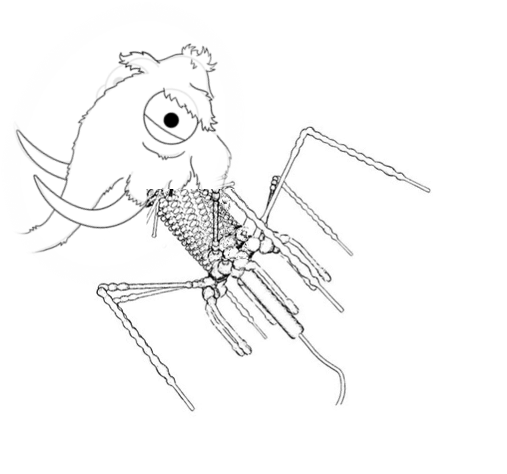

# phamut
Find mutations in a phage/viral genome

1. Map reads to reference
2. Generate mpileup
3. Define snps : perl SNPs_V2.pl [mpileup file] [minimum coverage] [minimum percentage of variant] 

example: perl snps_v2.pl mpileup_polished_BAL150-HD_vs_Fivephages.tab 10 20 | grep 'Pa222' > Pa222_polished_BAL150-HD_cov10_snp20.txt
